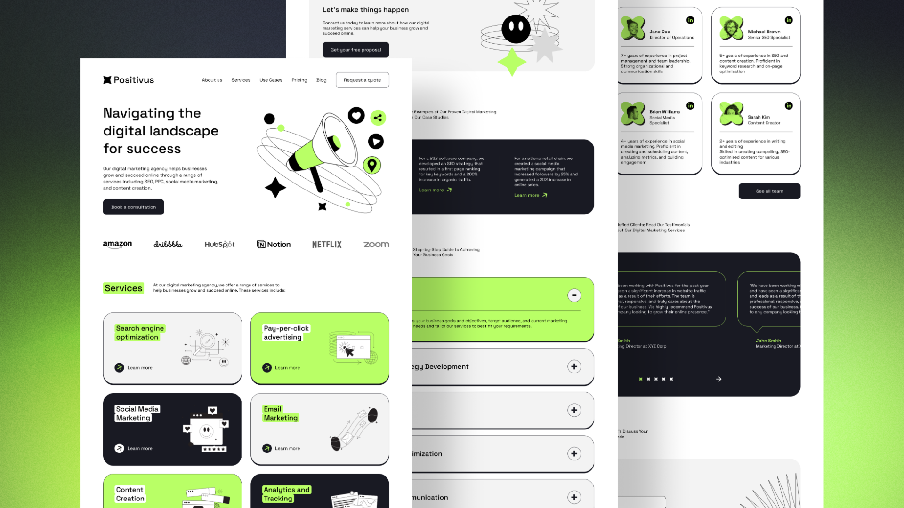

# Positivus Landing Page

The Positivus is a beautiful and functional landing page design created specifically for digital marketing agencies. With its clean and modern design, Positivus is the perfect template to showcase your agency's services and case studies to potential clients. It is built using Next.js for server-side rendering and Tailwind CSS for styling.This project was inspired by a figma design I came across here -> [Link to the figma design](https://www.figma.com/community/file/1230604708032389430)

## Table of Contents

- [Overview](#overview)
  - [Project Screenshot 🔳](#screenshot-)
- [Features](#features)
- [Technologies Used](#technologies-used)
- [Getting Started](#getting-started)
- [Installation](#installation)
- [Usage](#usage)
- [Contributing](#contributing)
- [License](#license)

## Overview

### Project Screenshot 🔳



## Features

- Responsive design
- Fast loading times
- Easy to customize
- SEO friendly
- A beautiful and modern design that is sure to impress potential clients
- Built with Next.js and Tailwind CSS

## Technologies Used

- [Next.js](https://nextjs.org/)
- [Tailwind CSS](https://tailwindcss.com/)

## Getting Started

To get a local copy up and running, follow these simple steps.

### Prerequisites

Make sure you have Node.js and npm installed on your machine.

- [Node.js](https://nodejs.org/)
- [npm](https://www.npmjs.com/)

### Installation

1. Clone the repository
   ```sh
   git clone https://github.com/your-username/positivus-landing-page.git
   ```
2. Navigate to the project directory
   ```sh
   cd positivus-landing-page
   ```
3. Install the dependencies
   ```sh
   npm install
   ```

### Usage

To start the development server, run:

```sh
npm run dev
```

Open [http://localhost:3000](http://localhost:3000) with your browser to see the result.

To build the project for production, run:

```sh
npm run build
```

To start the production server, run:

```sh
npm start
```

## Contributing

Contributions are what make the open-source community such an amazing place to learn, inspire, and create. Any contributions you make are **greatly appreciated**.

1. Fork the Project
2. Create your Feature Branch (`git checkout -b feature/AmazingFeature`)
3. Commit your Changes (`git commit -m 'Add some AmazingFeature'`)
4. Push to the Branch (`git push origin feature/AmazingFeature`)
5. Open a Pull Request

## License

Distributed under the MIT License. See `LICENSE` for more information.